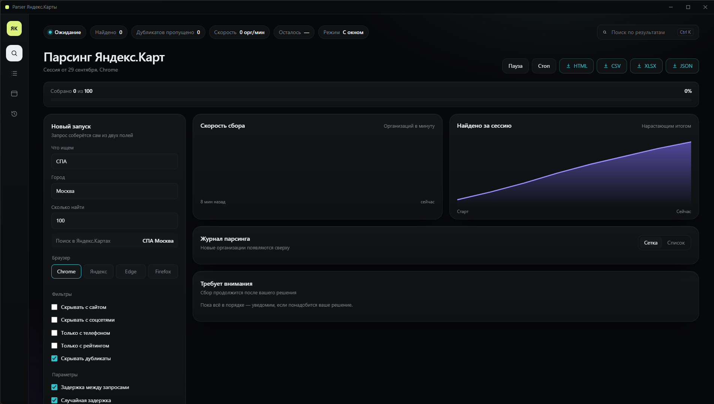
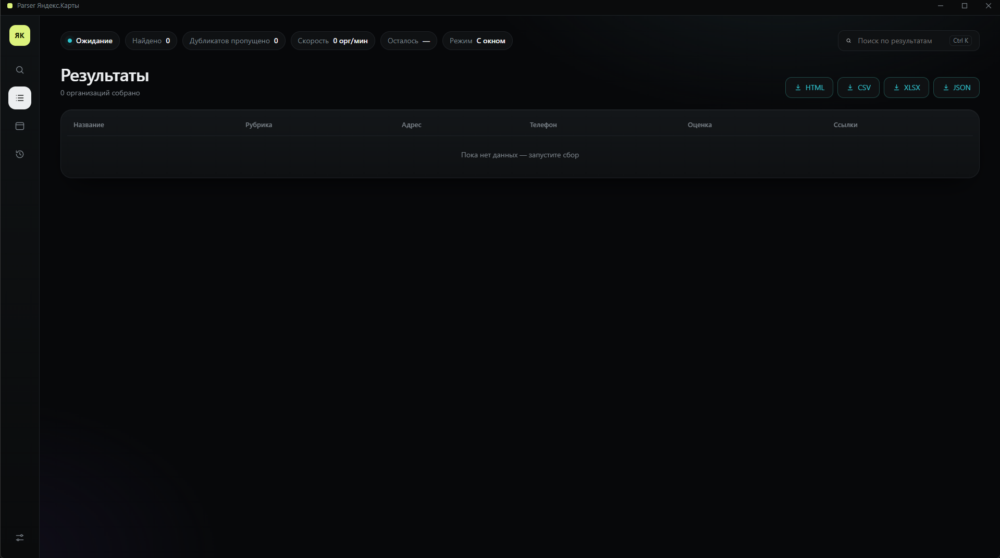
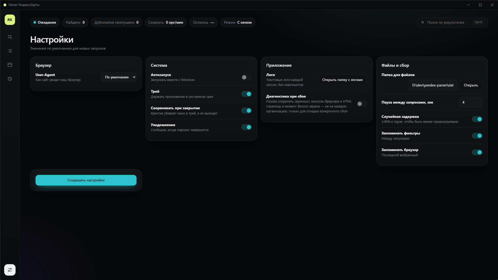

# Yandex Parser

⚠️ **Статус: v1.0.1 alpha. Работает, но нестабильно.**

Парсер данных из Яндекс.Карт. Собирает информацию об организациях — название, рубрика, адрес, телефон, рейтинг, ссылки — и выгружает в CSV, XLSX, JSON или HTML.



## Что умеет

- 🔍 Поиск организаций по запросу и городу
- 📋 Сбор карточек: название, рубрика, адрес, телефон, рейтинг, соцсети
- 🗂️ Фильтры: только с телефоном, только с рейтингом, скрывать дубликаты
- 💾 Экспорт в CSV, XLSX, JSON, HTML
- 🖥️ Десктопное приложение на pywebview — отдельное окно, без браузера
- 📜 История запусков и живой журнал найденных организаций
- 🛡️ Обработка капчи и «белого экрана» с возможностью продолжить сбор вручную

## Скриншоты

### Главный экран


### Результаты



### Настройки



## Установка

Краткая версия:

```bash
git clone https://github.com/manypon/parser-yandex.map.git
cd parser-yandex.map
python -m venv .venv
.venv\Scripts\activate
pip install -r requirements.txt
python main.py
```

Полная инструкция со всеми деталями — требования, поддерживаемые браузеры, решение типовых проблем, где хранятся данные — в файле **[docs/INSTALL.md](docs/INSTALL.md)**.

## ⚠️ Известные ограничения

**Парсер нестабилен из-за защиты Яндекса.**

- **Белый экран после ~5–20 карточек.** Яндекс детектит автоматизацию через `navigator.webdriver` (Selenium по стандарту W3C выставляет этот флаг) и перестаёт отдавать контент. Лечится уменьшением скорости, перезапуском сессии или — радикально — переходом на stealth-сборку Firefox (запланировано в следующих версиях).
- **Нет ротации IP и прокси.** С одного IP больше нескольких десятков карточек подряд собрать не получится.
- **Селекторы привязаны к текущей вёрстке.** При обновлении фронтенда Яндекс.Карт парсер может перестать собирать данные — тогда нужно обновить регулярки в `app/scraper.py`.
- **Тестировалось только на Windows 10 и 11.** На macOS и Linux должно работать, но не проверялось.

Если тебе нужен **стабильный** парсер Яндекс.Карт прямо сейчас — этот проект не подходит. Смотри в сторону `camoufox` или `invisible_playwright` — это инструменты, на которые проект планирует мигрировать.

## Поддерживаемые браузеры

Chrome, Яндекс.Браузер, Edge, Firefox. Парсер запускает браузер с отдельным профилем в папке `data/profiles/` — твои личные вкладки, куки и история не затрагиваются.

Рекомендуется **Google Chrome** — с ним меньше всего проблем с драйвером.

## Стек

| Компонент | Технология |
|---|---|
| Язык | Python 3.10+ |
| Браузер | Selenium 4.15+ |
| Интерфейс | pywebview |
| Экспорт | openpyxl |

## Структура проекта

```
parser-yandex.map/
├── app/                  # бэкенд
│   ├── api.py            # точки входа для UI
│   ├── browser_manager.py # управление браузером
│   ├── config.py         # пути, настройки по умолчанию
│   ├── exporter.py       # экспорт в CSV/XLSX/JSON/HTML
│   ├── logger.py         # логирование сессий
│   ├── models.py         # модель Organization
│   ├── runner.py         # оркестрация сбора
│   ├── scraper.py        # логика парсинга Яндекс.Карт
│   └── storage.py        # настройки и история
├── ui/                   # фронтенд (pywebview)
│   └── index.html
├── docs/                 # документация
│   ├── INSTALL.md
│   ├── CHANGELOG.md
│   └── screenshots/
├── landing-page/         # лендинг для Netlify
├── data/                 # данные приложения (не коммитится)
├── main.py               # точка входа
├── requirements.txt
└── README.md
```

## Документация

- **[docs/INSTALL.md](docs/INSTALL.md)** — полная инструкция по установке и решению проблем.
- **[docs/CHANGELOG.md](docs/CHANGELOG.md)** — что менялось между версиями.

## Лицензия

MIT. Лицензия распространяется **только на исходный код** проекта и не предоставляет прав на использование данных, полученных с помощью парсера.

## ⚖️ Дисклеймер

Проект создан в образовательных и исследовательских целях. Автор не несёт ответственности за использование полученных данных. Перед использованием убедитесь, что ваши действия не нарушают [Условия использования Яндекс.Карт](https://yandex.ru/legal/maps_termsofuse/) и законодательство вашей юрисдикции.

## Контакты

- **Issues:** [github.com/manypon/parser-yandex.map/issues](https://github.com/manypon/parser-yandex.map/issues)
- **Автор:** [@manypon](https://github.com/manypon)
